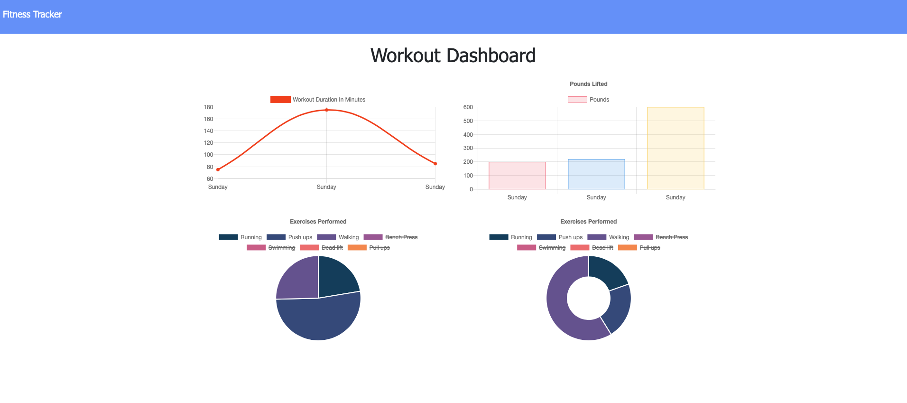

# workout-tracker

This is a workout tracking application that helps you keep track of your workout routine and helps you to visualize your progress using charts. You will reach your fitness goals more quickly when you can track your workout progress.

---
 

[LIVE ON HEROKU](https://stark-brook-49785.herokuapp.com/stats)

 

### Table of Contents
- [Screen Shots](#screen-shots)
- [User Story](#user-story)
- [Business Context](#business-context)
- [Technologies](#technologies)
- [Usage](#usage)
- [References](#references)
- [License](#license)
- [Author Info](#author-info)

---
 

### Screen Shots
- Landing Page

- DashBoard

- Add Exercise

---
 

### User Story

* As a user, I want to be able to view create and track daily workouts. I want to be able to log multiple exercises in a workout on a given day. I should also be able to track the name, type, weight, sets, reps, and duration of exercise. If the exercise is a cardio exercise, I should be able to track my distance traveled.

---
 

### Business Context

A user will reach their fitness goals more quickly when they track their workout progress.

---
 

### Technologies
- HTML5
- CSS3
- Javascript
- Semantic UI
- Node.js
- Express
- Mongodb
- Mongooes
- MVC

---
 

### Usage

This application is running on a webpage deployed on Heroku. When the user loads the page, users can see their lastest data and have the option to create workout or continue workout. Users can also see their progress in the dashboard.

The user is able to:

  * Add exercises to the current workout plan.

  * Add new exercises to a new workout plan.

  * Users can view their progress in the dashbord for 7 days.

[Back To The Top](#Workout-Tracker)

---
 

### References

- w3school -- [Node.js NPM](https://www.w3schools.com/nodejs/nodejs_npm.asp)
- NPM -- [Node Package Managment](https://www.npmjs.com/)
- Inquirer -- [Inquirer module](https://www.npmjs.com/package/inquirer)
- Node.js -- [About Node.js](https://nodejs.org/en/)
- json -- [The package.json guide](https://nodejs.dev/learn/the-package-json-guide)
- Mongodb -- [Mongodb](https://docs.mongodb.com/manual/reference/resource-document/)
- Express -- [express module](https://www.npmjs.com/package/express)

[Back To The Top](#Workout-Tracker)

---
### License

---

 

### Author Info

- Linkedin -- [Amit Karmacharya](https://www.linkedin.com/in/amit-karmacharya-b344731ab/)
